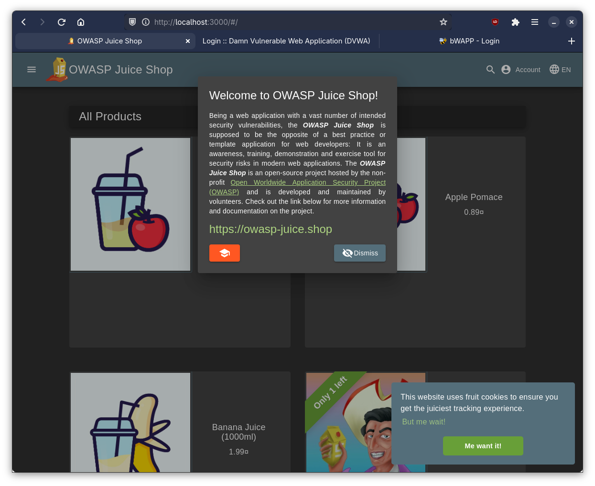

<p align="center">
    
</p>

<div align="center">
    <h2 style="border-bottom: none; margin-bottom: 0;">Dockerized VM for UC2PEN10</h2>
    <p>Recreating the original <b>Pen-Target-202526-v1.0</b> VM in docker for easier
    portability and support for multiple architectures like x86_86 and arm64.</p>
</div>

## 🚀 How to run
PEN Lab is nothing more than a docker compsose setup that runs the same web servers
as __Pen-Target-202526-v1.0__, but in a container instead of in a VM. If you're already
familiar with docker and docker compose you can just run the container as you see fit,
but if you aren't familiar with docker you can just run the wrapper script I've created.

### 📦 Wrapper Script
Just run `./start-penlab.sh` to start the script. It will automatically start and build
all required docker setup, and then print out an information screen similar to the
original VM.

```
####################################################
Welcome to Penetration Testing Lab 2025/26
Running on Linux x86_64

IP1: 127.0.0.1 (localhost)
IP2: 192.168.0.1 (network)

To access:
  - OWASP Juice Shop:
    http://192.168.0.1:3000
    http://localhost:3000

  - Damn Vulnerable Web Application:
    http://192.168.0.1/DVWA
    http://localhost/DVWA

  - Buggy Web Application (bWAPP):
    http://192.168.0.1/bWAPP
    http://localhost/bWAPP
    (Login: bee / bug)

Service Status:
  - Juice Shop: running
  - DVWA: running
  - bWAPP: running

####################################################

Commands:
  View logs:    docker compose logs -f
  Restart lab:  docker compose restart
  Shutdown:     docker compose down

Would you like to view live logs? (y/n): █
```

It will print links to all three web servers for both your local host, and an URL you
can use in a VM or other computer on your network. It will also print the status of the
three servers. If it says anything other than `running`, something has gone wrong! Just
contact me if you need any assistance getting the script up and running. It will also
show some handy docker commands showing how to stop the container.

Lastly it will ask if you want to view the live logs. This is essentially the same a
running `docker compose logs -f`. If you don't know what any of this means, just type
`n`.

Now you can open and see all three pages running in your browser🎉!


## 📄 Techical Details
These are the technical details for those interested.

I've used a docker compose script to run the web servers whilest routing the web apps
to the same endpoints as there were in the original VM, with Juice Shop at
`http://IP:3000`, DVWA at `http://IP/DVWA` and bWAPP at `http://IP/bWAPP`.

### 🍹 Juice Shop
The Juice Shop was really simple as it is actually just the container
`bkimminich/juice-shop` that already runs at port 3000, so all I needed to do was
add it as a service and expose port 3000🙌.

### 🪟 Damn Vulnerable Web Application
Damn Vulnerable Web Application was also relatively simple as it has an official
docker image avilable `ghcr.io/digininja/dvwa:latest`. Tho it needs some extra setup
to make it work by adding a DB to it. This is fortunately relatively simple to do
by just making a basic `mariadb:10` service for the dvwa service.

### 🐛 Buggy Web App
The Buggy Web App was dificult to implement, as there wasn't any bwapp docker images
that supported arm64, so I had to make it myself. I just created a dockerfile called
`Dockerfile.bwapp`. It makes a Linux machine with PHP 7.4 Apache that supports both
x86_86 and arm64. It then goes through the process to build and set up Buggy Web App.

The dockerfile configures Buggy Web App to use the right database and sets the
permissions correctly, but I've also added an extra step that automatically initializes
the database so the user doesn't have to go through the usual manual steps of going to
the `/install.php` endpoint and initializing the database there. I do the automatic
database initialization in the `bwapp-entrypoint.sh` script.

### 📡 Nginx
I just made a standard `nginx.conf` config file that redirects dvwa and bwapp to their
respective endpoints.


## 🚗 Roadmap
- [x] Add Windows support
